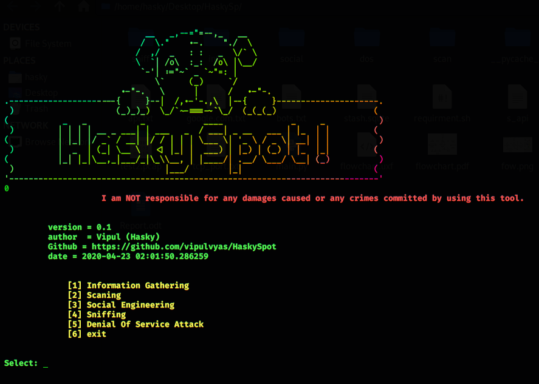

# HaskySpot

## Introduction 
```
Report.odt
```

## Installation 

```
git clone https://github.com/vipulvyas/HaskySpot/
cd HaskySpot
chmod +x requirment.sh
./requirment.sh
python3 main.py
```
```
install lolcate  not compulsory`
API : Required
Shodan
Sendgrid
```



## @Vipulvy90808568
